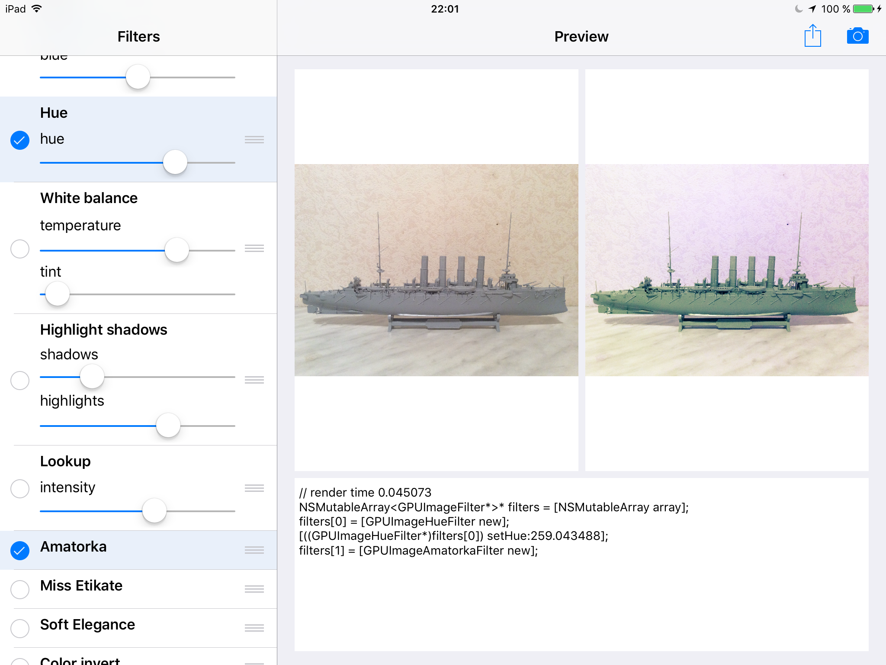

# Overview
The iPad application for combine multiple filters of [GPUImage library](https://github.com/BradLarson/GPUImage) and get code in realtime.

# Screenshot

# License
BSD-style, with the full license available in LICENSE.md